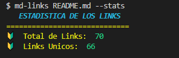

# Markdown Links

## Descripción
Markdown es un lenguaje de marcado ligero muy popular entre developers. 
Es usado en muchísimas plataformas que manejan texto plano (GitHub, foros, blogs, ...).
Estos archivos `Markdown` normalmente contienen _links_ (vínculos/ligas) que
muchas veces están rotos o ya no son válidos y eso perjudica mucho el valor de
la información que se quiere compartir.

Es por eso que surge "md-links" una herramienta que te permite obtener información, sobre los links del archivo/directorio que sean de extensión '.md'.
## Diagrama de Flujo

## Instalación
* Ejecutar el siguiente comando: npm i md-links-anaisva

## Uso
* El comando cli es : md-links < path >.
* Este comando sirve tanto para archivos como para directorios, al ingresar el comando md-links <path> 
  lo que obtendras es un listado de links cada uno con las tres siguientes opciones : 
  1. href -> Haciendo referencia al link.
  2. text -> El texto que contiene cada link.
  3. file -> El ruta de donde se obtuvo el link.
* Si quieres ver las distintas opciones que existen podras colocar :  md-links --help.
* --validate : Con esta opcion obtendras un listado con las siguientes opciones:
  1. href -> Haciendo referencia al link.
  2. text -> El texto que contiene el link.
  3. file -> El ruta de donde se obtuvo el link.
  4. status -> El estado del link.
  5. status text -<> El texto del estado siendo fail un fallo y ok que el link se obtuvo correctamente.
* --stats : Con esta opcion obtendras un listado de las estadisticas del link, tanto la cantidad de links totales como links unicos.
* --validate --stats: Estas opciones juntas te dan un listado de las estadisticas completas, tanto la cantidad de links totales, unicos y rotos.

##  Ejemplos de Uso
* md-links 

* md-links --help

* md-links < file >

* md-links < directory >

* md-links < file > --validate

* md-links < file > --stats

* md-links < file > --validate --stats

